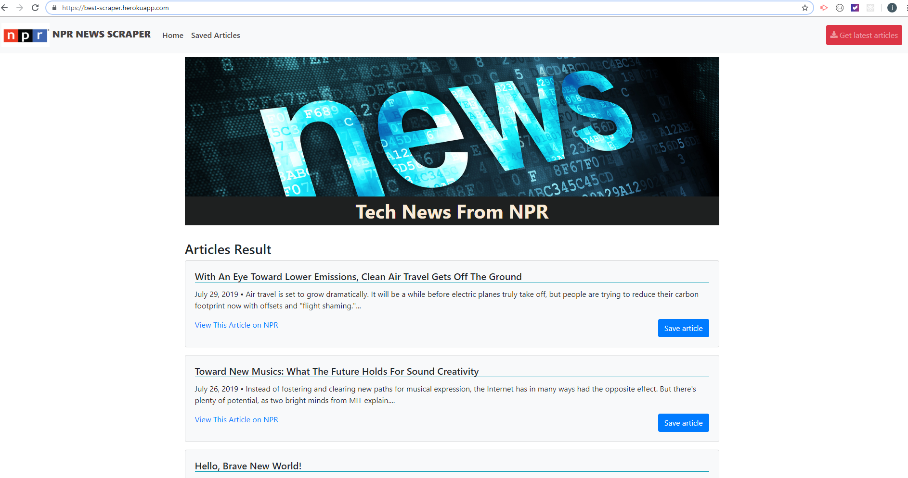
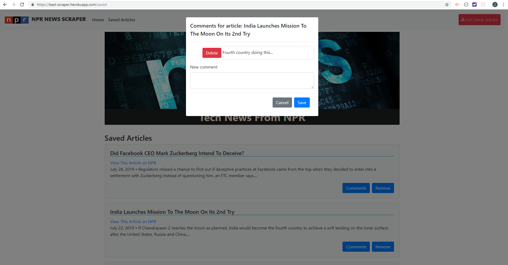

# NPR Tech News Scraper
-------
- **For:** Coding Bootcamp
- **Developer:** [RAFAEL UZCATEGUI](https://github.com/Rafaelias86)

This app allows users to view NPR Tech News articles also save some articles to read later and comment on their save ones.
Every article displayed includes a title, a summary and a link to the source article.
The app uses Node/Express for the server and routing, MongoDB/Mongoose for the database and models, Handlebars for the layout and views, & Cheerio/ Axios for scraping the data from www.npr.org

## Getting Started

These instructions will get you a copy of the project up and running on your local machine for development. 
You will need [Node.js](https://nodejs.org/en/) and [MongoDB](https://www.mongodb.com/) installed locally.

1. Install dependencies
2. In your CLI, enter **mongod**
3. In a new CLI window, go to root of directory and enter **node server.js** 
4. In browser, navigate to **http://localhost:8000**

### Dependencies

You will need to npm install the following node modules:

1. express
2. express-handlebars
3. mongoose
4. body-parser
5. cheerio
6. axios

## Screenshots
### *Home Page

### *Saved Articles Page

